# AI助理專案 - API結構與流程圖

本文件提供AI助理專案中所有程式檔案的類別、類別簡介、函式名稱與函式簡介，並以流程圖展示各元件間的互動關係。

## 目錄

1. [核心模組](#核心模組)
   - [whisper_module.py - 語音輸入轉文字模組](#whisper_modulepy---語音輸入轉文字模組)
   - [context_module.py - 上下文解答模組](#context_modulepy---上下文解答模組)
   - [rag_module.py - RAG檢索生成模組](#rag_modulepy---rag檢索生成模組)
   - [mcp_module.py - MCP工具使用模組](#mcp_modulepy---mcp工具使用模組)
   - [emotion_module.py - 情緒辨識模組](#emotion_modulepy---情緒辨識模組)
   - [response_module.py - 回應整合模組](#response_modulepy---回應整合模組)
   - [voice_module.py - 語音生成模組](#voice_modulepy---語音生成模組)
2. [輔助模組](#輔助模組)
   - [utils.py - 通用工具函數模組](#utilspy---通用工具函數模組)
   - [memory.py - 對話記憶管理模組](#memorypy---對話記憶管理模組)
   - [config.py - 系統配置模組](#configpy---系統配置模組)
3. [介面模組](#介面模組)
   - [gradio.py - 圖形化使用者介面](#gradiopy---圖形化使用者介面)
   - [cli.py - 命令列介面](#clipy---命令列介面)
   - [main.py - 主程式入口點](#mainpy---主程式入口點)
4. [配置檔案](#配置檔案)
   - [mcp.json - MCP工具配置檔案](#mcpjson---mcp工具配置檔案)
   - [characteristic.txt - 派蒙角色設定檔案](#characteristictxt---派蒙角色設定檔案)
5. [系統流程圖](#系統流程圖)

## 核心模組

### whisper_module.py - 語音輸入轉文字模組

#### WhisperModule 類別
將語音輸入轉為文字，支援96種語言，輕量高效

| 函式名稱 | 函式簡介 |
| ------- | ------- |
| `__init__(self, model_config=None)` | 初始化Whisper模型 |
| `transcribe_audio(self, audio_path)` | 將音頻文件轉錄為文字 |
| `transcribe_from_microphone(self, duration=5)` | 從麥克風錄製音頻並轉錄為文字 |
| `detect_language(self, audio_path)` | 檢測音頻中的語言 |
| `save_audio(self, audio_data, output_path)` | 保存音頻數據到文件 |

### context_module.py - 上下文解答模組

#### ContextModule 類別
使用Google flan-T5-base模型根據上下文進行問題解答並生成思考邏輯

| 函式名稱 | 函式簡介 |
| ------- | ------- |
| `__init__(self, model_config=None)` | 初始化flan-T5模型 |
| `generate_answer(self, question, context=None, generate_reasoning=True)` | 根據上下文生成問題的答案和思考邏輯 |
| `is_question_relevant(self, question, context)` | 判斷問題是否與上下文相關 |

### rag_module.py - RAG檢索生成模組

#### RAGModule 類別
使用FAISS向量資料庫和mT5-base模型實現檢索增強生成，從歷史對話、文件和TXT/PDF檔案中檢索相關資訊並生成總結

| 函式名稱 | 函式簡介 |
| ------- | ------- |
| `__init__(self, model_config=None)` | 初始化RAG模型 |
| `_load_or_create_index(self)` | 載入或創建FAISS索引 |
| `_create_new_index(self)` | 創建新的FAISS索引 |
| `_save_index(self)` | 保存FAISS索引和文檔 |
| `add_document(self, text, metadata=None)` | 將文檔添加到向量資料庫 |
| `add_conversation(self, conversation)` | 將對話添加到向量資料庫 |
| `add_file(self, file_path, chunk_size=1000, overlap=200)` | 讀取文件（TXT或PDF）並將其分段添加到向量資料庫 |
| `search(self, query, top_k=None)` | 搜索與查詢相關的文檔 |
| `generate_summary(self, query, search_results)` | 根據搜索結果生成總結 |
| `process_query(self, query)` | 處理查詢，搜索相關文檔並生成總結 |
| `get_file_statistics(self)` | 獲取向量資料庫中的文件統計信息 |
| `clear_file_data(self, file_path=None)` | 清除向量資料庫中的文件數據 |

### mcp_module.py - MCP工具使用模組

#### MCPModule 類別
使用Facebook XLM-RoBERTa-base模型解析MCP工具，選擇並執行適當工具

| 函式名稱 | 函式簡介 |
| ------- | ------- |
| `__init__(self, model_config=None)` | 初始化MCP模型 |
| `_load_mcp_config(self)` | 載入MCP配置文件 |
| `_get_available_tools(self)` | 獲取可用的MCP工具列表 |
| `should_use_tool(self, query)` | 判斷是否應該使用MCP工具 |
| `select_tool(self, query)` | 選擇適合查詢的MCP工具 |
| `prepare_tool_parameters(self, tool, query)` | 根據查詢準備工具參數 |
| `execute_tool(self, tool_name, parameters)` | 執行MCP工具 |
| `process_query(self, query)` | 處理查詢，選擇並執行適當的MCP工具 |

### emotion_module.py - 情緒辨識模組

#### EmotionModule 類別
使用MT5-base-finetuned-emotion模型分析輸入文字和最終回應句子的情緒，為每個句子添加情緒標籤

| 函式名稱 | 函式簡介 |
| ------- | ------- |
| `__init__(self, model_config=None)` | 初始化情緒辨識模型 |
| `split_into_sentences(self, text)` | 將文本分割為句子 |
| `analyze_emotion(self, text)` | 分析文本的情緒 |
| `add_emotion_tags(self, text)` | 為文本的每個句子添加情緒標籤 |
| `analyze_input_emotion(self, text)` | 分析輸入文本的整體情緒分佈 |
| `extract_emotions_from_tagged_text(self, tagged_text)` | 從帶標籤的文本中提取情緒和對應的文本片段 |

### response_module.py - 回應整合模組

#### ResponseModule 類別
使用Phi-2-persona-chat模型整合三種處理結果，根據人物設定生成風格化文字回應，透過鏈式思考確保人設一致性

| 函式名稱 | 函式簡介 |
| ------- | ------- |
| `__init__(self, model_config=None)` | 初始化回應整合模型 |
| `_load_characteristic(self)` | 載入人物設定文件 |
| `generate_response(self, query, context_answer="", rag_summary="", mcp_result="", emotion_distribution=None, conversation_history=None)` | 整合三種處理結果，生成風格化回應 |
| `chain_of_thought_response(self, query, context_answer="", rag_summary="", mcp_result="", emotion_distribution=None, conversation_history=None)` | 使用鏈式思考生成風格化回應，並返回思考過程 |

### voice_module.py - 語音生成模組

#### VoiceModule 類別
使用OpenVoice v2模型將帶有情緒標籤的文字轉為語音，根據標籤調整語調，支援聲音克隆和多語言輸出

| 函式名稱 | 函式簡介 |
| ------- | ------- |
| `__init__(self, model_config=None)` | 初始化語音生成模型 |
| `_load_model(self)` | 載入OpenVoice模型 |
| `_get_emotion_parameters(self, emotion)` | 根據情緒獲取語音參數 |
| `load_speaker_embedding(self, speaker_name)` | 載入說話者嵌入 |
| `save_speaker_embedding(self, speaker_name, embedding)` | 保存說話者嵌入 |
| `extract_speaker_embedding(self, audio_path)` | 從音頻文件提取說話者嵌入 |
| `text_to_speech(self, text, output_path, speaker_embedding=None, language="zh")` | 將文字轉為語音 |
| `emotional_tts(self, tagged_text, output_path, speaker_embedding=None, language="zh")` | 將帶有情緒標籤的文字轉為帶有情緒語調的語音 |
| `_merge_audio_files(self, input_files, output_file)` | 合併多個音頻文件 |

## 輔助模組

### utils.py - 通用工具函數模組

提供各模組共用的輔助函數，包含文字預處理、模型載入管理、多語言處理、情緒標籤解析、檔案操作等功能

| 函式名稱 | 函式簡介 |
| ------- | ------- |
| `setup_logger(name, level="INFO")` | 設置並返回一個日誌記錄器 |
| `preprocess_text(text)` | 清理和標準化輸入文字 |
| `detect_language(text)` | 識別文本的語言 |
| `parse_emotion_tags(text)` | 解析帶有情緒標籤的文本 |
| `read_text_file(file_path, encoding='utf-8')` | 讀取文本文件 |
| `read_pdf_file(file_path)` | 讀取PDF文件 |
| `split_text_into_chunks(text, chunk_size=1000, overlap=200)` | 將文本分割成重疊的塊 |
| `save_json(data, file_path, encoding='utf-8')` | 將數據保存為JSON文件 |
| `load_json(file_path, encoding='utf-8')` | 從JSON文件載入數據 |
| `safe_model_inference(func)` | 模型推論的裝飾器，處理異常並確保安全執行 |

### memory.py - 對話記憶管理模組

#### MemoryManager 類別
管理對話歷史和文件記憶

| 函式名稱 | 函式簡介 |
| ------- | ------- |
| `__init__(self, memory_config=None)` | 初始化記憶管理器 |
| `_load_conversation_history(self)` | 載入對話歷史 |
| `save_conversation_history(self)` | 保存對話歷史 |
| `add_message(self, role, content)` | 添加消息到對話歷史 |
| `clear_conversation_history(self)` | 清除對話歷史 |
| `get_recent_history(self, count=None)` | 獲取最近的對話歷史 |
| `search_history(self, query)` | 搜索對話歷史 |

### config.py - 系統配置模組

包含所有模型路徑和參數設定，提供系統全局配置

## 介面模組

### gradio.py - 圖形化使用者介面

#### GradioInterface 類別
使用Gradio建立AI助理的圖形化使用者介面，整合所有模組功能，提供語音輸入輸出、文件上傳、對話記憶等功能

| 函式名稱 | 函式簡介 |
| ------- | ------- |
| `__init__(self)` | 初始化Gradio介面和所有模組 |
| `_init_modules(self)` | 初始化所有AI模組 |
| `_create_interface(self)` | 創建Gradio介面 |
| `_get_custom_css(self)` | 獲取自定義CSS樣式 |
| `_create_chat_tab(self)` | 創建對話頁籤 |
| `_create_document_tab(self)` | 創建文件管理頁籤 |
| `_create_voice_tab(self)` | 創建語音設定頁籤 |
| `_create_settings_tab(self)` | 創建系統設定頁籤 |
| `process_input(self, text_input)` | 處理文字輸入 |
| `process_audio_input(self, audio_input)` | 處理語音輸入 |
| `clear_chat(self)` | 清除對話歷史 |
| `toggle_thinking_display(self, show)` | 切換思考過程顯示 |
| `process_uploaded_files(self, files)` | 處理上傳的文件 |
| `clear_all_files(self)` | 清除所有文件 |
| `refresh_file_stats(self)` | 刷新文件統計 |
| `get_saved_speakers(self)` | 獲取已保存的說話者列表 |
| `clone_voice(self, audio_file, speaker_name)` | 克隆語音 |
| `refresh_speakers(self)` | 刷新說話者列表 |
| `select_speaker(self, speaker_name)` | 選擇說話者 |
| `save_settings(self, show_thinking, autoplay)` | 保存設定 |
| `launch(self, share=False)` | 啟動Gradio介面 |

### cli.py - 命令列介面

#### CLIInterface 類別
提供AI助理的命令列介面，支援文字輸入輸出、語音互動和文件處理

| 函式名稱 | 函式簡介 |
| ------- | ------- |
| `__init__(self)` | 初始化命令列介面和所有模組 |
| `_init_modules(self)` | 初始化所有AI模組 |
| `print_welcome(self)` | 顯示歡迎訊息 |
| `print_help(self)` | 顯示幫助訊息 |
| `process_input(self, text_input)` | 處理文字輸入 |
| `process_command(self, command)` | 處理命令 |
| `_record_voice(self)` | 錄製語音並處理 |
| `_list_speakers(self)` | 列出已保存的說話者 |
| `_select_speaker(self, speaker_name)` | 選擇說話者 |
| `_clone_voice(self, audio_file, speaker_name)` | 從音頻文件克隆語音 |
| `_add_file(self, file_path)` | 添加文件到知識庫 |
| `_list_files(self)` | 列出已添加的文件 |
| `_clear_files(self)` | 清除所有文件 |
| `_play_audio(self, audio_path)` | 播放音頻文件 |
| `run(self)` | 運行命令列介面 |

### main.py - 主程式入口點

提供圖形介面和命令列介面的選擇

| 函式名稱 | 函式簡介 |
| ------- | ------- |
| `main()` | 主程式入口點 |
| `check_environment()` | 檢查環境是否符合要求 |

## 配置檔案

### mcp.json - MCP工具配置檔案
包含browser_use和filesystem MCP server的配置，符合Anthropic提出的MCP格式

### characteristic.txt - 派蒙角色設定檔案
包含原神中派蒙角色的個性、語錄和AI提示，用於生成符合角色設定的回應

## 系統流程圖

```mermaid
graph TD
    %% 主程式流程
    main.py.main --> main.py.check_environment
    main.py.main --> |CLI模式| cli.py.CLIInterface.__init__
    main.py.main --> |圖形介面模式| gradio.py.GradioInterface.__init__
    
    %% CLI介面流程
    cli.py.CLIInterface.__init__ --> cli.py.CLIInterface._init_modules
    cli.py.CLIInterface._init_modules --> whisper_module.py.WhisperModule.__init__
    cli.py.CLIInterface._init_modules --> context_module.py.ContextModule.__init__
    cli.py.CLIInterface._init_modules --> rag_module.py.RAGModule.__init__
    cli.py.CLIInterface._init_modules --> mcp_module.py.MCPModule.__init__
    cli.py.CLIInterface._init_modules --> emotion_module.py.EmotionModule.__init__
    cli.py.CLIInterface._init_modules --> response_module.py.ResponseModule.__init__
    cli.py.CLIInterface._init_modules --> voice_module.py.VoiceModule.__init__
    cli.py.CLIInterface.run --> cli.py.CLIInterface.print_welcome
    cli.py.CLIInterface.run --> cli.py.CLIInterface.process_command
    cli.py.CLIInterface.process_command --> cli.py.CLIInterface.process_input
    cli.py.CLIInterface.process_command --> cli.py.CLIInterface._record_voice
    cli.py.CLIInterface.process_command --> cli.py.CLIInterface._add_file
    cli.py.CLIInterface._record_voice --> whisper_module.py.WhisperModule.transcribe_from_microphone
    cli.py.CLIInterface._add_file --> rag_module.py.RAGModule.add_file
    
    %% Gradio介面流程
    gradio.py.GradioInterface.__init__ --> gradio.py.GradioInterface._init_modules
    gradio.py.GradioInterface._init_modules --> whisper_module.py.WhisperModule.__init__
    gradio.py.GradioInterface._init_modules --> context_module.py.ContextModule.__init__
    gradio.py.GradioInterface._init_modules --> rag_module.py.RAGModule.__init__
    gradio.py.GradioInterface._init_modules --> mcp_module.py.MCPModule.__init__
    gradio.py.GradioInterface._init_modules --> emotion_module.py.EmotionModule.__init__
    gradio.py.GradioInterface._init_modules --> response_module.py.ResponseModule.__init__
    gradio.py.GradioInterface._init_modules --> voice_module.py.VoiceModule.__init__
    gradio.py.GradioInterface.__init__ --> gradio.py.GradioInterface._create_interface
    gradio.py.GradioInterface._create_interface --> gradio.py.GradioInterface._create_chat_tab
    gradio.py.GradioInterface._create_interface --> gradio.py.GradioInterface._create_document_tab
    gradio.py.GradioInterface._create_interface --> gradio.py.GradioInterface._create_voice_tab
    gradio.py.GradioInterface._create_interface --> gradio.py.GradioInterface._create_settings_tab
    
    %% 輸入處理流程
    cli.py.CLIInterface.process_input --> emotion_module.py.EmotionModule.analyze_input_emotion
    cli.py.CLIInterface.process_input --> context_module.py.ContextModule.generate_answer
    cli.py.CLIInterface.process_input --> rag_module.py.RAGModule.process_query
    cli.py.CLIInterface.process_input --> mcp_module.py.MCPModule.process_query
    cli.py.CLIInterface.process_input --> response_module.py.ResponseModule.chain_of_thought_response
    cli.py.CLIInterface.process_input --> emotion_module.py.EmotionModule.add_emotion_tags
    cli.py.CLIInterface.process_input --> voice_module.py.VoiceModule.emotional_tts
    
    gradio.py.GradioInterface.process_input --> emotion_module.py.EmotionModule.analyze_input_emotion
    gradio.py.GradioInterface.process_input --> context_module.py.ContextModule.generate_answer
    gradio.py.GradioInterface.process_input --> rag_module.py.RAGModule.process_query
    gradio.py.GradioInterface.process_input --> mcp_module.py.MCPModule.process_query
    gradio.py.GradioInterface.process_input --> response_module.py.ResponseModule.chain_of_thought_response
    gradio.py.GradioInterface.process_input --> emotion_module.py.EmotionModule.add_emotion_tags
    gradio.py.GradioInterface.process_input --> voice_module.py.VoiceModule.emotional_tts
    
    %% 語音處理流程
    whisper_module.py.WhisperModule.transcribe_from_microphone --> whisper_module.py.WhisperModule.transcribe_audio
    whisper_module.py.WhisperModule.transcribe_audio --> whisper_module.py.WhisperModule.detect_language
    
    %% 上下文處理流程
    context_module.py.ContextModule.generate_answer --> context_module.py.ContextModule.is_question_relevant
    
    %% RAG處理流程
    rag_module.py.RAGModule.__init__ --> rag_module.py.RAGModule._load_or_create_index
    rag_module.py.RAGModule.process_query --> rag_module.py.RAGModule.search
    rag_module.py.RAGModule.process_query --> rag_module.py.RAGModule.generate_summary
    rag_module.py.RAGModule.add_file --> utils.py.read_text_file
    rag_module.py.RAGModule.add_file --> utils.py.read_pdf_file
    rag_module.py.RAGModule.add_file --> utils.py.split_text_into_chunks
    rag_module.py.RAGModule.add_file --> rag_module.py.RAGModule.add_document
    
    %% MCP處理流程
    mcp_module.py.MCPModule.__init__ --> mcp_module.py.MCPModule._load_mcp_config
    mcp_module.py.MCPModule.process_query --> mcp_module.py.MCPModule.should_use_tool
    mcp_module.py.MCPModule.process_query --> mcp_module.py.MCPModule.select_tool
    mcp_module.py.MCPModule.process_query --> mcp_module.py.MCPModule.prepare_tool_parameters
    mcp_module.py.MCPModule.process_query --> mcp_module.py.MCPModule.execute_tool
    
    %% 情緒處理流程
    emotion_module.py.EmotionModule.add_emotion_tags --> emotion_module.py.EmotionModule.split_into_sentences
    emotion_module.py.EmotionModule.add_emotion_tags --> emotion_module.py.EmotionModule.analyze_emotion
    emotion_module.py.EmotionModule.analyze_input_emotion --> emotion_module.py.EmotionModule.split_into_sentences
    emotion_module.py.EmotionModule.analyze_input_emotion --> emotion_module.py.EmotionModule.analyze_emotion
    
    %% 回應生成流程
    response_module.py.ResponseModule.__init__ --> response_module.py.ResponseModule._load_characteristic
    response_module.py.ResponseModule.chain_of_thought_response --> response_module.py.ResponseModule.generate_response
    
    %% 語音生成流程
    voice_module.py.VoiceModule.__init__ --> voice_module.py.VoiceModule._load_model
    voice_module.py.VoiceModule.emotional_tts --> utils.py.parse_emotion_tags
    voice_module.py.VoiceModule.emotional_tts --> voice_module.py.VoiceModule._get_emotion_parameters
    voice_module.py.VoiceModule.emotional_tts --> voice_module.py.VoiceModule.text_to_speech
    voice_module.py.VoiceModule.emotional_tts --> voice_module.py.VoiceModule._merge_audio_files
    
    %% 記憶管理流程
    memory.py.MemoryManager.__init__ --> memory.py.MemoryManager._load_conversation_history
    memory.py.MemoryManager.add_message --> memory.py.MemoryManager.save_conversation_history
    memory.py.MemoryManager._load_conversation_history --> utils.py.load_json
    memory.py.MemoryManager.save_conversation_history --> utils.py.save_json
```

上圖展示了AI助理系統的主要流程，從主程式入口點開始，經過介面選擇、模組初始化，到處理用戶輸入、生成回應的完整流程。系統的核心處理流程包括：

1. 用戶輸入（文字或語音）
2. 語音轉文字（如果是語音輸入）
3. 情緒分析
4. 上下文解答處理
5. RAG檢索生成處理
6. MCP工具使用處理
7. 回應整合與風格化
8. 情緒標籤添加
9. 語音生成
10. 輸出回應（文字和語音）

這個流程確保了AI助理能夠理解用戶輸入，從多種渠道獲取相關資訊，並生成符合角色設定的回應，同時支援多模態互動。
